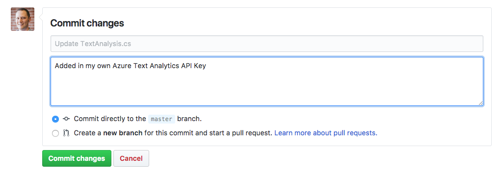
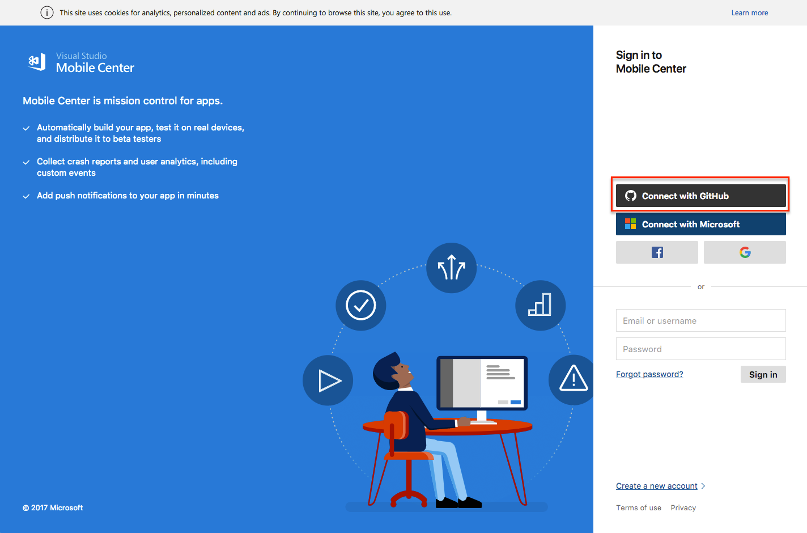
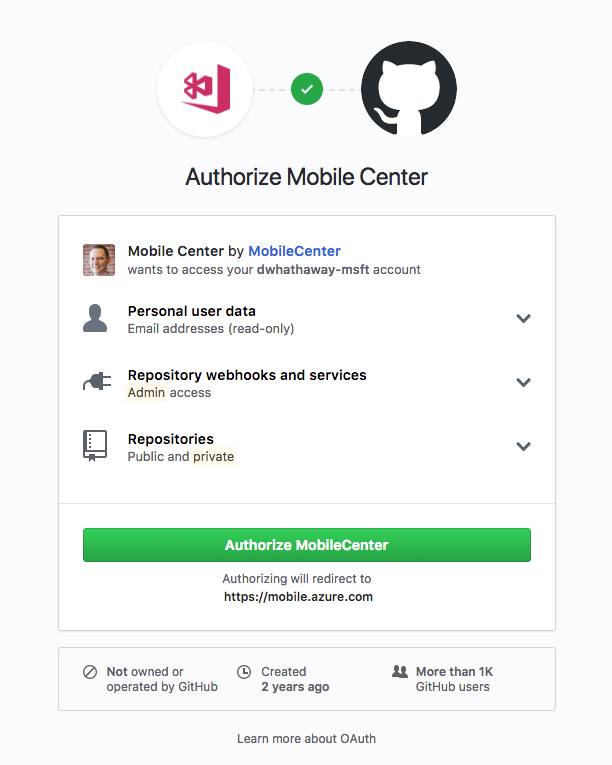
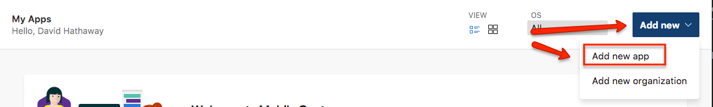
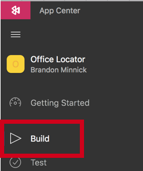
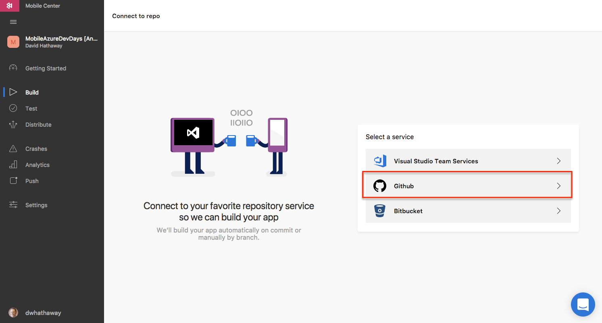
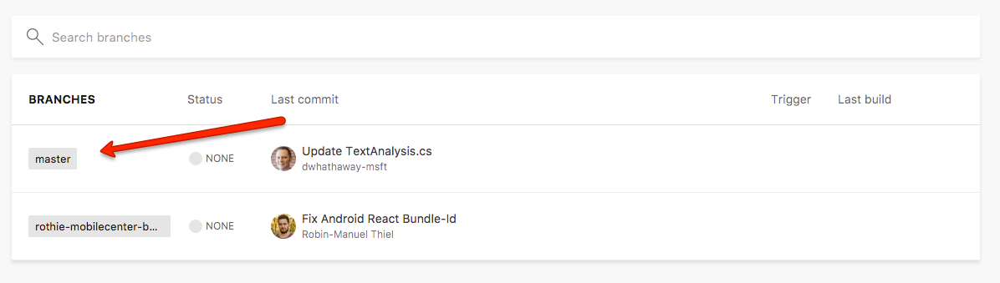
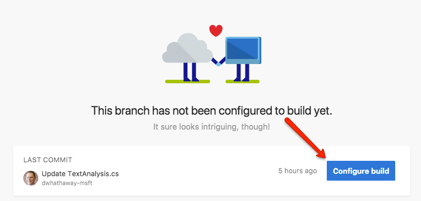
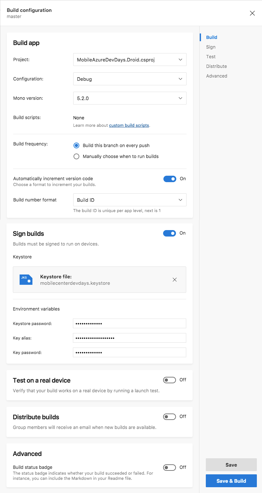
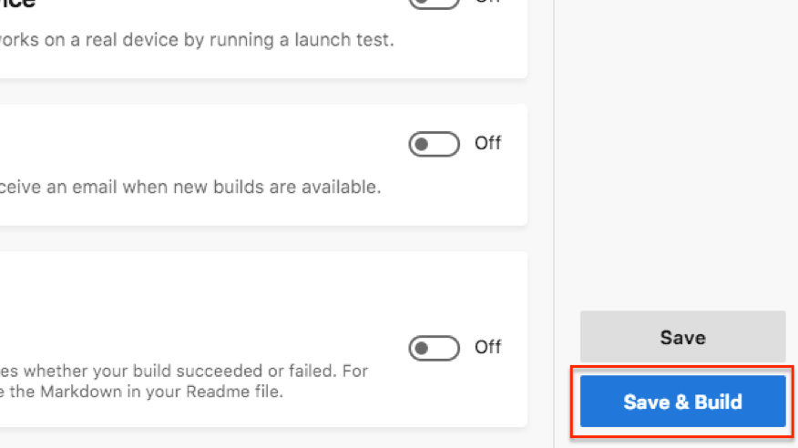

# Visual Studio App Center Hack

### Step 1: Complete the [Easy Tables Hack](./easy-table-hack.md)

### Step 2: Update your code in GitHub with the App Service URL

- In your web browser, navigate to your GitHub repo
- Navigate to `Constants/AzureConstants.cs`
- Click the "Edit" icon
- If Line #5 contains `#error Missing Azure Endpoint URL`, delete the entire line
- Browse to your app in the Azure Portal, and copy the URL form the Overview page.  To do so, click the "Overview" blade, and then hover over the URL to show the 'page' icon.  Click on that icon to copy your URL


After both code changes, your code should look like this:

```csharp
public static class AzureConstants
{
    public const string MobileServiceClientUrl = "https://[your endpoint here]";
}
```

- Scroll to the bottom and enter in any comment into the "Commit changes" field set, and click "Commit changes" button to commit your key to source control



> __Note:__ For this exercise, we are committing your API key to source control.  In general, we recommend using services like [Azure Key Vault](https://azure.microsoft.com/en-us/services/key-vault/) to securely store your API keys, and integrate them into your code during your build.

### Step 3: Create your App Center Account

In this step, we're not going to sign into App Center using our Github credentials, and set up our builds. Since you are already signed in to GitHub, we can simply authorize App Center to access your GitHub repositories using the following steps.

- Browse to [https://appcenter.ms/apps](https://appcenter.ms/apps), and click on "Connect with GitHub"



- Click the "Authorize App Center" button



### Step 4: Create and App in App Center

- In the top right corner of App Center, click the "Add new" button, and select "Add new app"



- Enter `Office Locator` in the name field, and choose Android for the OS, and Xamarin for the Platform.

- Click "Add new app" in the bottom right corner

Once created, App Center will automatically navigate you to your newly created app

### Step 5: Set up a Build

- Click on the "Build" service from the left hand menu



Here, you will connect App Center to your GitHub repository that you created at the beginning of this exercise

- Select "Github"



- Search for "app-office-locator"
- Click on the "app-office-locator" repo in the search results

App Center will now perform it's magic, and connect up to your repo. Once this is done, we can set up our build.

- Click on the "Master" branch



- Click "Configure build"



- Configure your app as show in the image below



- Click "Save & Build"



App Center will now go ahead and build your app, and create an APK file.  Go ahead, grab a cup of coffee, this will only take a few minutes, but you've got time.

### Congratulations

You've built your first app using Visual Studio App Center.  For more information on how to create 5-start apps with Visual Studio App Center, please visit [https://www.visualstudio.com/app-center](https://aka.ms/visualstudioappcenter).

There you can find information on the Crash, Test, and Analytics capabilities of Visual Studio App Center, as well as how to integrate into additional services like Application Insights, or Visual Studio Team Services.
