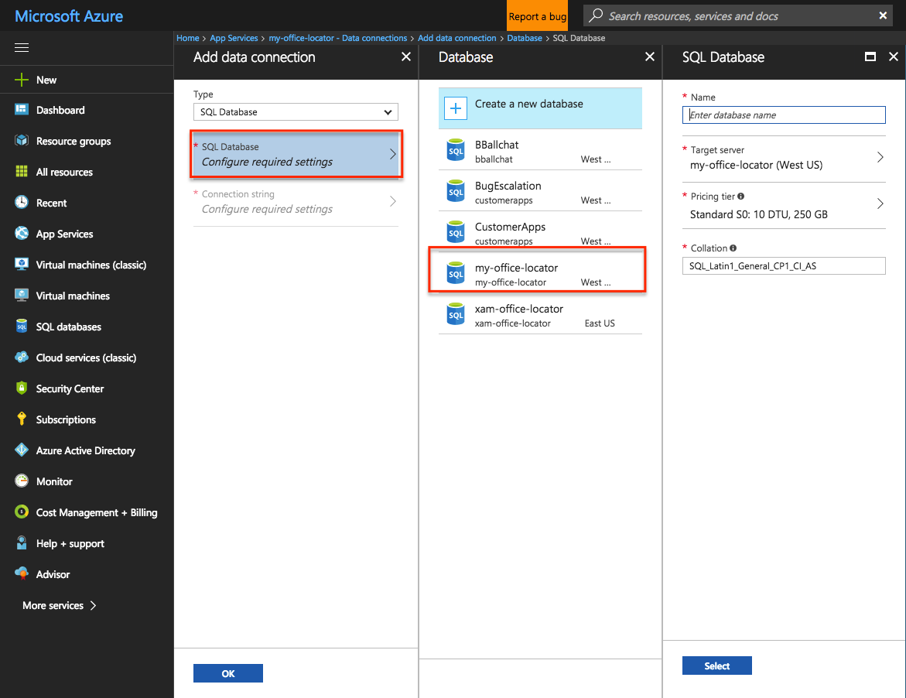
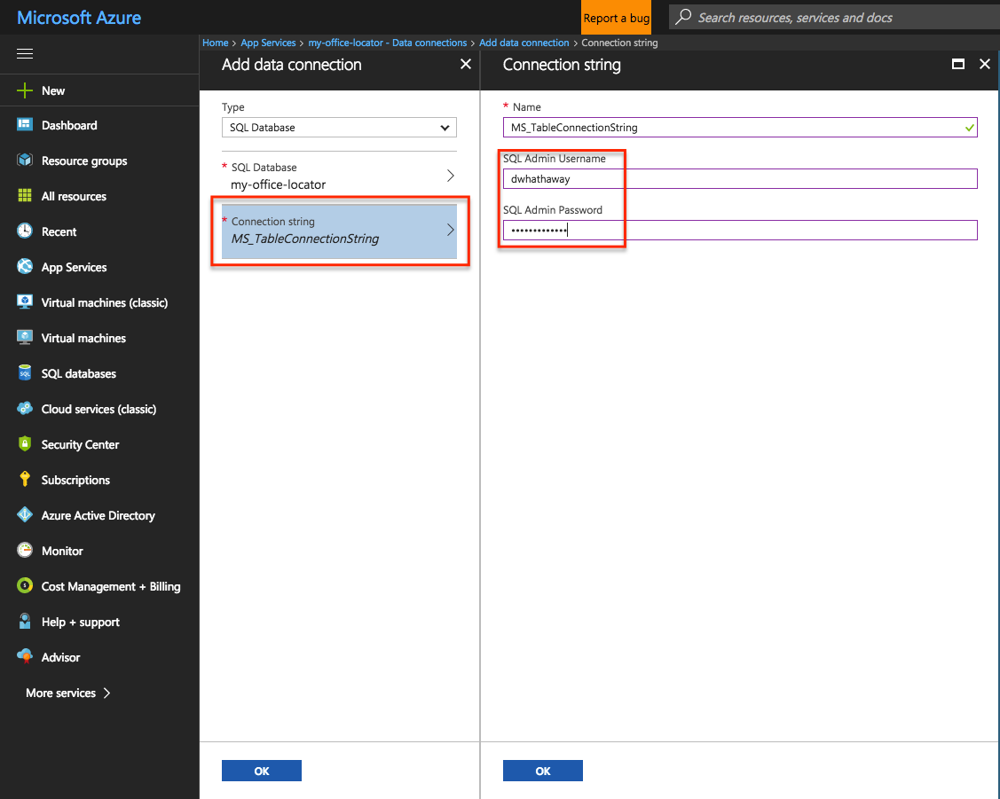
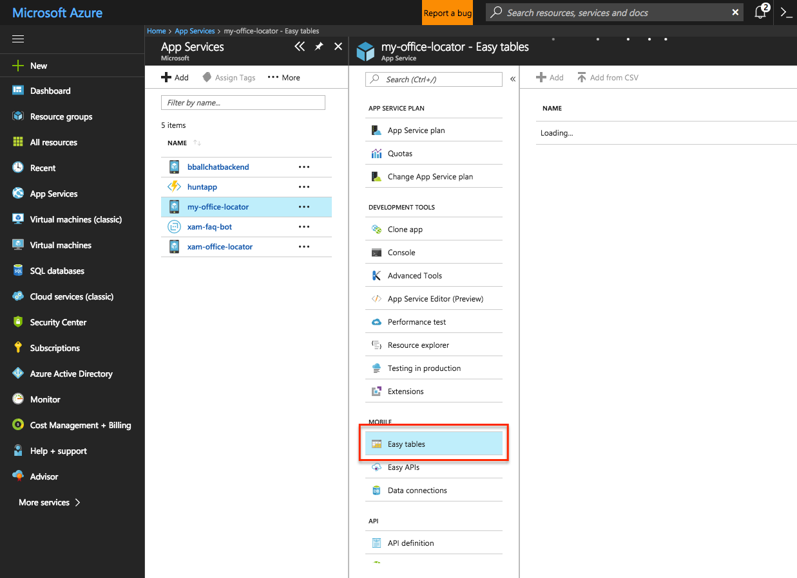
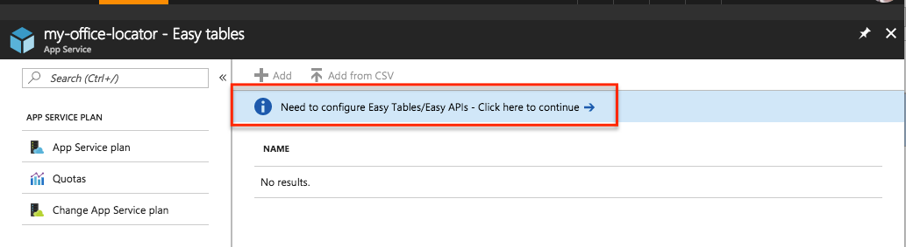
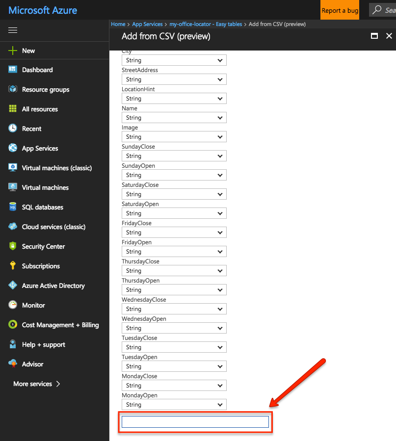

# Office Locator Hack

In this hack, we're going to show how to spin up your own Office Locator app in just a few steps.  After completing this hack, you'll be have a fully working Office Locator app that you can populate with your own office locations.

### Step 1: Clone the Repo

Make a local directory, and then clone the repo from [https://github.com/dwhathaway/app-office-locator](https://github.com/dwhathaway/app-office-locator)

```git clone https://github.com/dwhathaway/app-office-locator.git```

### Step 2: Create a new Mobile App Service

- Browse to [https://portal.azure.com](https://portal.azure.com)
- New > Mobile App
- Give the app a name (this must be unique - don't worry, the portal will tell you if it's not), select your Azure Subscription, choose "Create new" for the resource group, and copy the same value you used for your app name into the Resource Group Name field (we'll create all of our resources under this same Resource Group).
- Click "Create"


### Step 3: Create a SQL Database

> __Note:__ For this exercise, we'll create a new SQL Server instance but you can also coose an existing instance if you prefer.

- Once again, browse to [https://portal.azure.com](https://portal.azure.com)
- Click "SQL Databases" from the menu on the left of the page, then click the "+ Add" button
- Enter in a name for the database (e.g. `my-office-locator`)
- Choose your Azure Subscription
- Choose "Use existing", and select the `my-office-locator` resource group you created in the previous section
- Choose "Blank database"
- Click on "Server", and click "Create a new server"
- Enter a name for your server
- Enter a username (must be unique, and you cannnot use `sa`)
- Enter in a unique password to the "Password" and "Confirm password" fields
- Choose a region (any region is fine)
- Click "Select".  This will return you to the SQL Database blade where you'll finalize configuration
- Choose "Pricing tier", and select "Basic", then click "Apply"
- Click "Create" to create the SQL Database

### Step 4: Set up your Data connection

- In your Mobile App Service, select the "Data connections" blade
- Click "Add" to add a new Data Connection
- Click the "Sql Database" option, and choose the database that we created in __Step 3__



- Click on "Connection string", and enter in the Username/Password that you used in Step 3 to create your database, then click "OK"



- Click "OK" one more time to add the connection.  This will take a minute or so to complete, at which point you'll see a note toast in the upper right hand corner indicating that the connection has been added


### Step 3: Set up your Easy Tables

- While still in your app, click on the "Easy tables" blade

 

You'll see a message stating that Tables/Easy APIs hasn't been configured yet.  Click on that message to configure.



You've already set up your data connection, so all you need to do is check the checkbox that says "I acknowledge that this will overwrite all site contents.", and click the "Create TodoItem table" button.  This will initialize your Mobile App Service for Easy Tables


This will take a minute or two to complete.  Once it's done, you'll be returned back to the Easy Tables blade, where you can set up your Location and Feedback tables

### Step 4: Upload the CSV file to populate locations

- On the Easy Tables blade, click the "Add from CSV" button
- Browse Click the "Select a file" field, and browse to the `my-office-locator.csv` file in the `data` folder of the repo that you cloned in __Step 1__
- Change the "Name" field to "Location", and leave all the rest of the fields as they are
- Scroll to the bottom, and click the white square with the blue border (yes, that's a button)



This will initialize a new table, and populate it with the locations that you uploaded. Scroll to the top of the page, and look for the "Successfully imported!" message, then click the "X" to close out the blade.

Next, we'll change the code in the app to pull from your App Service.

### Step 5: Run the app

- Launch Visual Studio, and open up the `Office-Locator.sln` file from the `/src` folder of the repo that you cloned in __Step 1__
- Open the `Office-Locator` project, and browse to the `Services` folder, and open `AzureDataStore.cs` file. 
- Switch back over to the Azure Portal, and go to the  
- Delete the `#error` pragma on Line #38
- Browse to your app in the Azure Portal, and copy the URL form the Overview page.  To do so, click the "Overview" blade, and then hover over the URL to show the 'page' icon.  Click on that icon to copy your URL


- Switch back to your open Visual Studio window, and paste the URL that you copied into the `MobileServiceClient()` constructor

```MobileService = new MobileServiceClient("[your endpoint here]");```

_Example:_

```MobileService = new MobileServiceClient("http://my-office-locator.azurewebsites.net");```

- Compile and run either the iOS or Android sample, which every you have a device/simulator already configured for debugging

# Congratulations!

You've complete this hack!  For bonus points, you can try the following:

- Create an additional Easy Table to collect Feedback
- Update the CSV file with your own locations
- Configure your app in Mobile Center