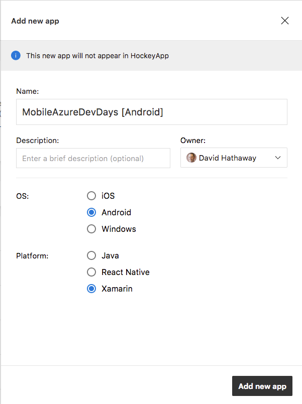
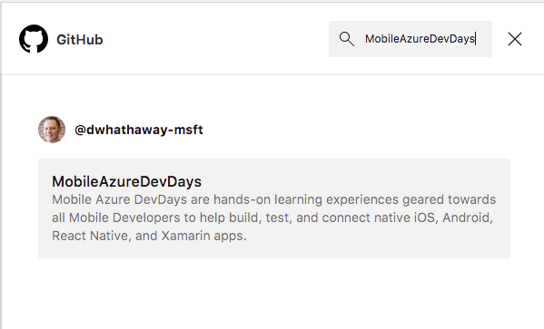
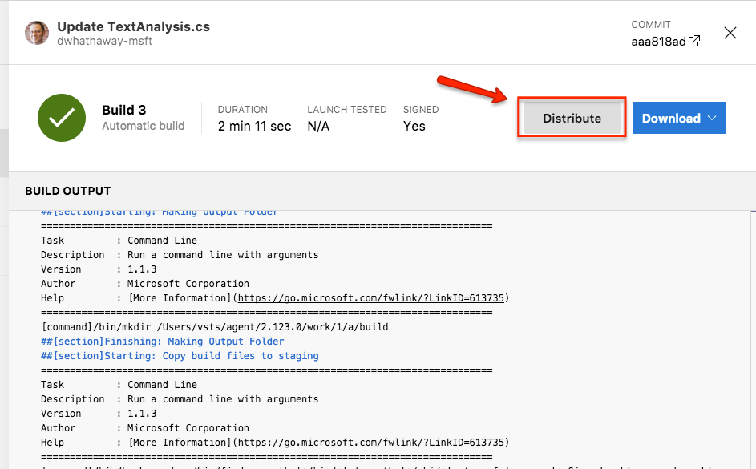
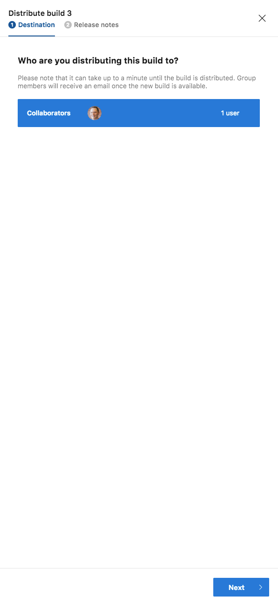
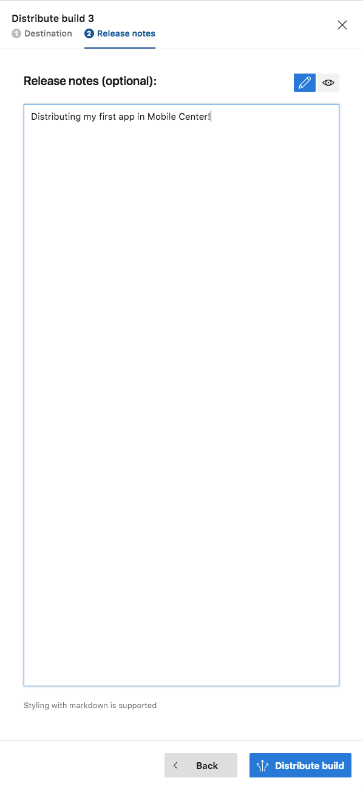
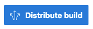

# Visual Studio Mobile Center Hack

### Step 1: Create a GitHub Account

If you already have a GitHub account, you can jump directly to Step 2 below.  Otherwise, please follow these steps to create your account:

- Browse to [https://github.com/join](https://github.com/join)
- Enter in your username, e-mail address, and a password


- Chose "Unlimited public repositories for free." This is sufficient for this exercise, and you can easily upgrade to a paid account later.


- Choose any additional options, or simply click "skip this step"


- Confirm your e-mail address by clicking the "Verify email address" link in the e-mail you received to the address used in step 2 above. (note, if you skip this step, you won't be able to continue with the tutorial).


Congrats! You're now ready to move on to Step 2: Forking the repo

### Step 2: Forking the "app-office-locator" repo

- Navigate to [http://github.com/dwhathaway/app-office-locator](http://github.com/dwhathaway/app-office-locator)


- Click the "Fork" icon in the top right corner.  You'll be brought to a subsequent screen showing that the repo is being forked, and then you'll ultimately arrive at your own forked copy of the repo that you'll use for the remainder of this exercise.


### Step 3: Create your Azure Account

There are several different ways to create an Azure account.  A few examples are:

- Your company/employer has a subscription, and has added you to it
- You have a visualstudio.com subscription (i.e. Enterprise, Professional, or Dev Essentials), and you have the associated Azure credits
- You've already signed up for the "Azure free account"

To check to see if you have an Azure subscription already, browse to [https://portal.azure.com](https://portal.azure.com).  Sign in with your existing Microsoft.com account, and browse to the "Subscriptions" blade in the Azure portal.

If you do not already have an account/subscription, you will be prompted to create one.  If you need to create a new account/subscription, browse to [https://azure.microsoft.com/en-us/free/](https://azure.microsoft.com/en-us/free/), and click the "Start free" button to begin starting your account.

> __Note:__ You will need to enter in a credit card to create your account.  This card will _only_ be used to pay for charges that exceeed your monthly allocation (e.g. $150/mo for Enterprise users).

### Step 4: Create a new Mobile App Service

- Browse to [https://portal.azure.com](https://portal.azure.com)
- New > Mobile App
- Give the app a name (this must be unique - don't worry, the portal will tell you if it's not), select your Azure Subscription, choose "Create new" for the resource group, and copy the same value you used for your app name into the Resource Group Name field (we'll create all of our resources under this same Resource Group).
- Click "Create"


### Step 5: Create a SQL Database

> __Note:__ For this exercise, we'll create a new SQL Server instance but you can also choose an existing instance if you prefer.

- Once again, browse to [https://portal.azure.com](https://portal.azure.com)
- Click "SQL Databases" from the menu on the left of the page, then click the "+ Add" button
- Enter in a name for the database (e.g. `my-office-locator`)
- Choose your Azure Subscription
- Choose "Use existing", and select the `my-office-locator` resource group you created in the previous section
- Choose "Blank database"
- Click on "Server", and click "Create a new server"
- Enter a name for your server
- Enter a username (must be unique, and you cannnot use `sa`)
- Enter in a unique password to the "Password" and "Confirm password" fields
- Choose a region (any region is fine)
- Click "Select".  This will return you to the SQL Database blade where you'll finalize configuration
- Choose "Pricing tier", and select "Basic", then click "Apply"
- Click "Create" to create the SQL Database

### Step 6: Set up your Data connection

- In your Mobile App Service, select the "Data connections" blade
- Click "Add" to add a new Data Connection
- Click the "Sql Database" option, and choose the database that we created in __Step 3__


- Click on "Connection string", and enter in the Username/Password that you used in Step 3 to create your database, then click "OK"


- Click "OK" one more time to add the connection.  This will take a minute or so to complete, at which point you'll see a note toast in the upper right hand corner indicating that the connection has been added


### Step 7: Set up your Easy Tables

- While still in your app, click on the "Easy tables" blade

 

You'll see a message stating that Tables/Easy APIs hasn't been configured yet.  Click on that message to configure.


You've already set up your data connection, so all you need to do is check the checkbox that says "I acknowledge that this will overwrite all site contents.", and click the "Create TodoItem table" button.  This will initialize your Mobile App Service for Easy Tables


This will take a minute or two to complete.  Once it's done, you'll be returned back to the Easy Tables blade, where you can set up your Location and Feedback tables

### Step 8: Upload the CSV file to populate locations

- On the Easy Tables blade, click the "Add from CSV" button
- Browse Click the "Select a file" field, and browse to the `my-office-locator.csv` file in the `data` folder of the repo that you cloned in __Step 1__
- Change the "Name" field to "Location", and leave all the rest of the fields as they are
- Scroll to the bottom, and click the white square with the blue border (yes, that's a button)


This will initialize a new table, and populate it with the locations that you uploaded. Scroll to the top of the page, and look for the "Successfully imported!" message, then click the "X" to close out the blade.

Next, we'll change the code in the app to pull from your App Service.


### Step 9: Update your code in GitHub with the App Service URL

- Browse to your GitHub repo, and then select 

app-office-locator > src > Office-Locator > Services.cs

- Choose the file TextAnalysis.cs, end then choose the "Edit" icon
- Delete the `#error` pragma on Line #38
- Browse to your app in the Azure Portal, and copy the URL form the Overview page.  To do so, click the "Overview" blade, and then hover over the URL to show the 'page' icon.  Click on that icon to copy your URL


After both code changes, your code should look like this:

````

public AzureDataStore()
{
    // This is a sample read-only azure site for demo
    // Follow the readme.md in the GitHub repo on how to setup your own.
    MobileService = new MobileServiceClient("[your endpoint here]");
}
````

- Scroll to the bottom and enter in any comment into the "Commit changes" field set, and click "Commit changes" button to commit your key to source control


> __Note:__ For this exercise, we are commiting your API key to source control.  In general, we recommend using services like [Azure Key Vault](https://azure.microsoft.com/en-us/services/key-vault/) to securely store your API keys, and integrate them into your code during your build.


### Step 10: Create your Mobile Center Account

In this step, we're not going to sign into Mobile Center using our Github credentials, and set up our builds. Since you are already signed in to GitHub, we can simply authorize Mobile Center to access your GitHub repositories using the following steps.

- Browse to [https://mobile.azure.com](https://mobile.azure.com), and click on "Connect with GitHub"


- Click the "Authorize MobileCenter" button


### Step 11: Create and App in Mobile Center

- In the top right corner of Mobile Center, click the "Add new" button, and select "Add new app"


- Enter `my-office-locator [Android]` in the name field, and choose Android for the OS, and Xamarin for the Platform.



- Click "Add new app" in the bottom right corner

Once created, Mobile Center will automatically navigate you to your newly created app

### Step 12: Set up a Build

- Click on the "Build" service from the left hand menu


Here, you will connect Mobile Center to your GitHub repository that you created at the beginning of this exercise

- Select "Github"


- Search for "app-office-locator"
- Click on the "app-office-locator" repo in the search results



Mobile Center will now perform it's magic, and connect up to your repo. Once this is done, we can set up our build.

- Click on the "Master" branch


- Click "Configure build"


- Configure your app as show in the image below


- Click "Save & Build"


Mobile center will now go ahead and build your app, and create an APK file.  Go ahead, grab a cup of coffee, this will only take a few minutes, but you've got time.


### Step 13: Distribute your app

Awesome, we're back.  Now that we've built an app, we can go ahead and distribute it

- On your completed build, click the "Distribute" button



- Choose the group you want to distribute to (you will only see "Collaborators", but documentation on creating additional distribution groups can be found [here](https://docs.microsoft.com/en-us/mobile-center/distribution/groups)), and click "Next"



- Enter in any comments that you want to show as release notes



4. Click "Distribute"



Once the distribution is complete, everyone in the distribution list will receive an e-mail letting them know that they can download/install the release.  Alternatively, you can browse to [https://install.mobile.azure.com](https://install.mobile.azure.com) from your mobile device (Safari on iOS, Chrome on Android) to view available releases.

### Congratulations!

You've not built, and distributed your first app using Visual Studio Mobile Center.  For more information on how to ship 5-start apps with Visual Studio Mobile Center, please visit [https://docs.mobile.azure.com](https://docs.mobile.azure.com).  There you can find information on the Crash, Test, and Analytics capabilities of Visual Studio Mobile Center, as well as how to integrate into additional services like Application Insights, or Visual Studio Team Services.